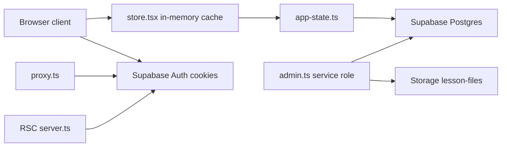

# Ember Maths12 — Tech Stack

**Audience:** humans and agents implementing or reviewing code  
**Product behaviour:** [`PRD.md`](PRD.md)  
**Coding conventions:** [`.cursor/rules/ember12.mdc`](../.cursor/rules/ember12.mdc)

This file is the as-built stack: what we use, which versions, and where it lives. It does not replace the PRD.

---

## Runtime & app framework

| Piece | Version (from [`package.json`](../package.json)) | Notes |
| ----- | ------------------------------------------------ | ----- |
| Node.js | 22+ (`engines.node`) | Required |
| Next.js | 16.3.0 | App Router under `src/app/` |
| React / React DOM | 19.2.8 | |
| TypeScript | 5 | `strict: true` |

Path alias: `@/` → `src/` ([`tsconfig.json`](../tsconfig.json)).

Before adding Next.js APIs, read `node_modules/next/dist/docs/` — this Next version differs from older training data.

**Session refresh** lives in [`src/proxy.ts`](../src/proxy.ts) (Next 16), not `middleware.ts`. The proxy calls [`src/lib/supabase/middleware.ts`](../src/lib/supabase/middleware.ts).

---

## Data layer — Supabase only

Product data is **Supabase** Auth + Postgres + Storage. The React store is an in-memory cache that hydrates and mutates through Supabase. Do **not** persist app state in `localStorage`.

### Auth clients

| Client | File | Key | Use |
| ------ | ---- | --- | --- |
| Browser | [`src/lib/supabase/client.ts`](../src/lib/supabase/client.ts) | Publishable / anon | Signup, login, client mutations |
| RSC | [`src/lib/supabase/server.ts`](../src/lib/supabase/server.ts) | Publishable / anon | Server Components, cookie session |
| Session refresh | [`src/lib/supabase/middleware.ts`](../src/lib/supabase/middleware.ts) via [`src/proxy.ts`](../src/proxy.ts) | Publishable / anon | Refresh Auth cookies on matched requests |
| Service role | [`src/lib/supabase/admin.ts`](../src/lib/supabase/admin.ts) | `SUPABASE_SERVICE_ROLE_KEY` | Server and seed only — never expose to the browser |

Libraries: `@supabase/ssr` and `@supabase/supabase-js`.

**Authorization role always comes from `public.profiles`, never from editable `user_metadata`.** Signup may write role/name into metadata so the `handle_new_user` trigger can create the profile; runtime checks read `profiles.role`.

### Postgres

Migrations live in [`supabase/migrations/`](../supabase/migrations/). Core tables include `profiles` (role, theme, location, `parent_id`), `student`, curriculum, progress, classes, groups, messages, corrections, and teacher lessons. RLS is defined in those migrations.

Local CLI project id: `Ember12` ([`supabase/config.toml`](../supabase/config.toml)).

### Storage

Bucket `lesson-files` holds admin/teacher PDF and Markdown uploads (max 20 MB per file).

### UI store

[`src/lib/store.tsx`](../src/lib/store.tsx) holds in-memory `AppState`. Load and write through [`src/lib/supabase/app-state.ts`](../src/lib/supabase/app-state.ts). Session identity comes from Auth cookies only.

### Not the data layer

[`src/generated/prisma/`](../src/generated/prisma/) is leftover generated code. There is no Prisma dependency in `package.json`. Do not treat it as the app data layer.

---

## UI

| Piece | Detail |
| ----- | ------ |
| Tailwind CSS | 4, via `@tailwindcss/postcss` ([`postcss.config.mjs`](../postcss.config.mjs), [`src/app/globals.css`](../src/app/globals.css)) |
| Icons | `lucide-react` |
| Charts | `recharts` |
| PDF slides | `pdfjs-dist` in [`src/lib/lesson-video/`](../src/lib/lesson-video/) |
| Design system | [`design-system/embermaths12/MASTER.md`](../design-system/embermaths12/MASTER.md); page files under `design-system/embermaths12/pages/` override when present |

Fonts via `next/font` only in [`src/app/layout.tsx`](../src/app/layout.tsx) — **Fraunces** (display) and **Outfit** (body). No Google Fonts `@import`.

Brand tokens:

| Token | Hex |
| ----- | --- |
| `ember-gold` | `#FCA311` |
| `ember-navy` | `#14213D` |
| `ember-black` | `#000000` |
| `ember-white` | `#FFFFFF` |
| `ember-gray` | `#E5E5E5` |

Gold CTAs use **navy** text for contrast.

---

## API routes

Normal signup and login use the browser Supabase client. These two routes are the only App Router APIs today:

| Route | Purpose |
| ----- | ------- |
| [`src/app/api/auth/signup/route.ts`](../src/app/api/auth/signup/route.ts) | Optional pre-confirmed signup when the real **service_role** secret is set |
| [`src/app/api/auth/delete-user/route.ts`](../src/app/api/auth/delete-user/route.ts) | Admin user delete (service role) |

---

## Tooling & deploy

| Tool | Role |
| ---- | ---- |
| ESLint 9 + `eslint-config-next` 16.3.0 | `npm run lint` |
| TypeScript `tsc --noEmit` | `npm run typecheck` |
| Vitest 4 | `npm test` / `npm run test:watch` — [`vitest.config.mts`](../vitest.config.mts), tests in `tests/unit` and `tests/integration` |
| Vercel | Deploy target (Next.js preset) |

---

## Environment variables

Set in `.env.local` (do not commit) and in the Vercel project:

| Variable | Where it is used |
| -------- | ---------------- |
| `NEXT_PUBLIC_SUPABASE_URL` | All Supabase clients |
| `NEXT_PUBLIC_SUPABASE_PUBLISHABLE_KEY` | Browser, RSC, and proxy (preferred) |
| `NEXT_PUBLIC_SUPABASE_ANON_KEY` | Fallback if the publishable key is unset |
| `SUPABASE_SERVICE_ROLE_KEY` | [`admin.ts`](../src/lib/supabase/admin.ts), seed scripts, optional signup/delete APIs — **never** expose to the browser |

---

## Out of stack (v1)

Live video hosting, real OCR/AI grading (MCQ and paper-scan feedback are deterministic mocks), email confirmation productization, and payments.
